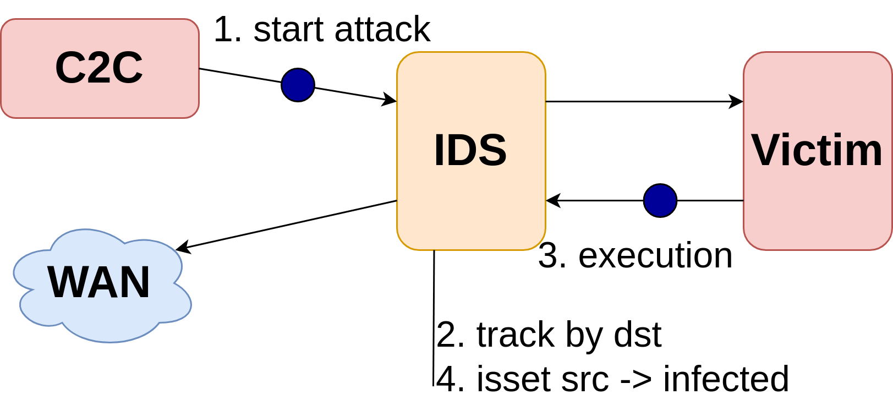

## Summary
The RFC discusses the possibility of removing inter-core dependencies in 
Suricata. The proposed solution includes isolation of shared structures and 
distributing them among worker cores. Some of the shared structures, such as 
the host table, can be offloaded to hardware. Alternatively, using local 
evaluation for rule and IP address tracking it is also possible to limit 
number of accesses to shared structures. The proposed solution aims to improve 
performance by minimizing problems like lock contention and cache invalidation.

## Motivation
Suricata process packets on a per-flow basis. However, possibly all structures 
(e.g. flow table, TCP reassembly or other tables) are shared among all 
Suricata workers. To solve synchronization, these are generally protected by 
locks. 

The per-flow processing suggest, Suricata can be transferred to an architecture
where each Suricata worker processes only set of flows and uses solely its 
data structures. This model is seen in many high-performance applications as 
it helps to avoid or minimize problems such as lock contention or cache 
invalidation. 

However, transition to this model complicates the fact that Suricata performs 
also cross-flow inspection (e.g. IP tracking). Receive side scaling (RSS) is 
technique for distributing load across multiple Suricata workers and is 
commonly used in current high-performance deployments. Traffic is distributed 
based on the 3/5-tuples extracted from the traffic. RSS ensures the same flow 
is delivered to the same worker each time from both directions. However, it 
does not guarantee to deliver two flows with a common IP address to the same
worker. 

To support the point of independent workers here are the initial measurements 
to boost your motivation and interest. I have done following experiments where
Suricata ran:

- without rules (NSM mode)
  - original Suricata from master branch
  - separate memory pools (receiving buffers) for individual workers
  - separate flow tables (receiving buffers) for individual workers
- with rules (ET Open)
  - original Suricata from master branch
  - separate flow tables (receiving buffers) for individual workers

The graphs below show individual variants (with and without rules). 
The same traffic has been been trasnmitted onto Suricata for around 60 seconds 
for each experiment. The transmit speed unit is megabits per second (Mbps).
Suricata were configured with 4 threads.

In the measurement where Suricata had disabled rules, orange line is considered
as a baseline as that it currently unmodified Suricata. We can look at 
the red line and see a mild improvement when each Suricata worker 
has its' own separate memory pool for receiving packets (pktmbuf mempool in DPDK terminology). The blue line represent a modification in which each Suricata 
worker has its own individual flow table as well as its own separate memory 
pool (as in the previous (red) experiment). Suricata in this case greatly 
benefits from the lockless structures as there is no need to synchronize 
threads and efficient hash lookups with less cache misses/invalidations. 
Compared to the baseline (10 Gbps) we can observe doubled throughput up to 
around 20 Gbps. 


Measurement with the rules shows less exciting results with nonetheless 20%
increase in the throughput. In this case we are only comparing Suricata master
(Suricata without modification) denoted as a red line to per-worker flow table variant denoted as a blue line. The variant with separate mempools was omitted in this measurement because it yielded in similar results as the red line. 

The doubled throughput is scaled down to 20% performance boost because 
performance penalty caused by lock contention is smaller when Suricata is 
"busier", i.e. when Suricata needs to do extra work, the impact of lock 
contention is smaller as opposed to when Suricata only needs to decode 
the packet and "note some details of it". However, dividing Suricata 
operations into the per-worker model I believe Suricata could scale more 
linearly as it would not result in lock contention again when adding more 
processing threads to Suricata. 


## Detailed explanation
Most of the Suricata tables indicate that it would be possible to isolate them 
to a separate worker cores. Those include e.g. flow table or TCP reassembly 
table.

However there are structures used by multiple cores:
- Host table
- Global thresholds

### Host table
The host table is used by the *track* rule keyword. By using this keyword in 
a rule, a user can track a selected source/destination IP address. The keyword
is used in combination with:
- xbits - similar to flowbits, can serve as a state variable for IP addresses,
- thresholds - thresholds are applied to alerts (so in a post-detection phase),
  where thresholding rules can decide whether to raise an alert or not.




### Global thresholds
Global thresholds are applied in the output module and evaluate whether an 
alert should be raised or not. There are multiple types of thresholds:
- limit - certain rule should raise an alert only X times in Y seconds
- threshold - certain rules should raise an alert only if a rule has been 
  hit X times in Y seconds
- suppress - certain rules to not raise an alert at all but be active 
  regardless (e.g. evaluate (set) xbits)
- rate_filter - change the action of a rule after Suricata hits X rules in 
  Y seconds (e.g. from ALERT to DROP)

### Problem definition
From the above, we identied that shared structures are used for:
- IP address tracking
- Rule tracking

Xbits can use `track` keyword with:
- by_src/by_dst - IP address (storage Host table)
- by_both - IP pair (flow) (storage IPPair)

Thresholds can use `track` keyword with:
- by_src/by_dst - IP address (storage Host table)
- by_both - IP pair (flow) (storage IPPair)
- by_rule - Signature id - track raised the number of raised SIG id rules 
  (storage probably Flow table)


### Proposed solution
#### IP address tracking
The only solution I see involves limiting access to the shared structures and 
as a result avoiding touching shared structures until very necessary. This 
can be done by offloading the Host table to the HW and adding metainformation 
to the individual packets by the NIC. IP matching is a doable task for HW and 
there are no problems with upper layers such as IP fragmentation/TCP reassembly. 
The added metainformation can be in the form of a flag (contains e.g. xbits 
or not) or directly in a collection of set xbits. The host table modification 
process could work in asynchronous or synchronous communication. In synchronous
mode, Suricata worker modifying the HW host table would need to wait to 
complete the whole transaction. In asynchronous mode, the worker would only 
send a modification request to the NIC's host table and it would continue in 
its' operation.

In a software-only solution, the solution could be implemented in autofp 
architecture where receiving threads would add the host table metainformation.
From DPDK side - rte_flow API can be used to implement this solution. It 
supports hardware offload and IP matching. Rte_flow rule actions that could 
be used to implement this are either META or MARK (currently MODIFY_ACTION).


#### Rule (and IP address) tracking 
For global thresholds, it would be possible to use local evaluation to find 
out whether accessing the shared table makes sense. At Suricata startup, 
Suricata loads a threshold configuration file. The file contains individual 
threshold rules. These rules are static and should not change during the 
Suricata run. They can be propagated to individual Suricata workers. With 
these thresholding rules in mind, workers would access the shared threshold 
table only if the generated alerts of the packet would match e.g. on rule:

```
threshold gen_id 1, sig_id 2002087, type threshold, \
  track by_src, count 10, seconds 60
```

the worker would access the shared thresholds table only if one of the 
raised alerts would have sig_id equal to 2002087 and NIC would mark the 
packet as tracked (host table residing on the NIC). This would limit the 
number of accesses to the shared table.
One possible problem could be thresholding rules such as:

```
threshold gen_id 1, sig_id 0, type threshold, \
  track by_rule, count 10, seconds 60
```

where sig_id == 0 means track every signature and only raise an alert if 
there were 10 alerts within 60 seconds. Considering what I read from the 
documentation, tracking all signatures under one counter should however be 
neither possible nor bring any practical use case.


## Drawbacks
Some packets can be already in the ring between the NIC and the Suricata - 
those would not be evaluated under IP tracking even in synchronous operation.

Asynchronous mode must tackle additional challenges like what to do on 
modification request failure. (when the HW host table is at the full capacity 
or when the request gets lost).

## Alternatives
* Alternative distribution to workers,
* Alternative detection of security incidents:
    * avoid using `track` keyword (avoid cross-flow dependencies), 
    * detect cross-flow dependencies in e.g. elastic

